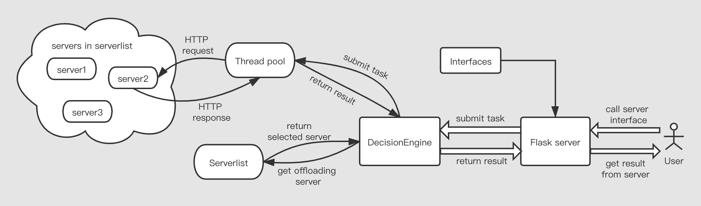

[English version](https://github.com/piaoliangkb/task-offloading/blob/master/README.md)

# task-offloading

task-offloading 是移动边缘计算环境下处理 HTTP 请求的任务卸载客户端。它可以将 HTTP 请求卸载到边缘服务器，在边缘节点进行高效计算的同时保证低延迟。

该客户端支持 **灵活的任务接口定义**，**自动化的任务卸载流程**，**易于指定任务执行位置**。

用户可以访问定义在 flask server 中的接口来执行特定的任务，并从接口获得返回结果，而不需要需考虑卸载流程细节。

## 目录

- [目录](#目录)
- [代码结构](#代码结构)
- [过程概览](#过程概览)
- [安装](#安装)
- [使用](#使用)
- [License](#license)

## 代码结构

`server.py` 文件中包含了类 `Server` 和基类 `ServerList` 的定义。ServerList 维护了一个当前可用的服务器列表，DecisionEngine 使用该列表来进行卸载服务器选择。开发者可以通过继承 `ServerList` 类的方法来定义他们自己的 ServerList 类，并实现和特定应用相关的服务器列表方法（例如 `FlaskTestServerList`)。 

`engine.py` 包含了 `DecisionEngine` 类的定义，该类主要负责如下任务：

- 根据决策算法选择卸载服务器

- 接受任务并提交到线程池

- 使用线程池来进行任务卸载并获得返回结果

- 计算吞吐量 （本机请求数量 / 吞吐量计算周期）

`interfaces.py` 定义了不同应用（不同任务）的接口（例如 `FlaskTestInterfaces`, `BDInterfaces`），这些接口会在面向用户的 flask server 中使用。

`config.py` 包含了不同应用的不同配置。

应用服务（flask servers）:

- `app.py` 涉及到 `FlaskTestConfig (config.py)`, `FlaskTestServerInterfaces (interfaces.py)`, `FlaskTestServerList (server.py)`. 该文件中定义了一系列简单的接口提供给用户访问，在接口的背后执行卸载流程；以及通过代码展示如何使用上述涉及到的模块。

  >`app.py` 涉及到的服务端代码在 `flask_test_example/` 文件夹中。在启动卸载客户端之前，需要在不同的服务器上运行服务端代码。

- `bdcontract.py` 定义了关于智能合约调用的任务卸载客户端接口。

## 过程概览



## 安装 

该项目使用 Python 3.7 实现，请使用 Python 3.7 或以上版本。

```
pip install -r requirements.txt
```

## 使用

### 对简单的 flask server `app.py` 进行测试

在 `app.py` 中，我定义了一些访问远程服务器的接口，其中服务器端代码位于文件夹 `flask_test_example/` 中。 因此，在运行此客户端之前，您需要在一个或者多个服务器上运行服务器端代码。服务端代码的运行方式在 `flask_test_example/README.md` 文件中。

在运行服务端代码之后，需要修改 `config.py` 文件中的 `FlaskTestConfig.server_list` 实例，该实例保存了应用初始化时的服务器列表。

之后，运行该卸载客户端。需要使用 `sudo`，默认 ip 地址是 `0.0.0.0`，默认端口是 `8899`:

```bash
sudo python3 app.py
```

随后你可以访问定义在 `app.py` 中提供给用户的接口了。卸载客户端会自动选取远端服务器，调用接口并将返回结果给用户。例如：

```bash
$ curl http://host:[port]/square/20
{
    "data": "400.0",
    "server": "127.0.0.1",
    "status_code": 200,
    "throughout": 0,
    "time": 8.00912618637085
}
```

任务卸载的细节部分可以参考源代码和卸载客户端的日志。

## License

MIT © 2020 piaoliangkb
