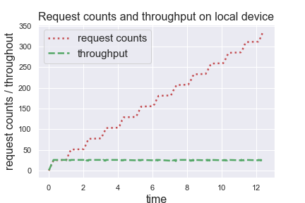

<!-- TOC -->

- [任务卸载客户端和智能合约引擎结合](#任务卸载客户端和智能合约引擎结合)
    - [简介](#简介)
    - [架构图](#架构图)
    - [服务器列表](#服务器列表)
    - [决策引擎](#决策引擎)
    - [安装和使用](#安装和使用)
    - [用户接口](#用户接口)
        - [ping](#ping)
        - [listcontractprocess](#listcontractprocess)
        - [execcontract](#execcontract)
        - [hello](#hello)
        - [listservers](#listservers)
    - [卸载过程的实验展示](#卸载过程的实验展示)
        - [参数配置](#参数配置)
        - [实验过程](#实验过程)
        - [实验结果可视化](#实验结果可视化)

<!-- /TOC -->

## 任务卸载客户端和智能合约引擎结合

该应用的用户接口代码在文件 [bdcontract.py](https://github.com/piaoliangkb/task-offloading/blob/master/bdcontract.py) 中。

和服务端关联的接口定义在文件 [interfaces.py](https://github.com/piaoliangkb/task-offloading/blob/master/interfaces.py) 中的 `BDInterfaces` 类。

### 简介

任务卸载客户端考虑了移动边缘计算环境下，移动终端计算能力不足的问题。当移动终端负载较高时，会将任务卸载到距离终端最近（延迟最低）的节点执行，并从节点获得返回结果。所以该任务卸载客户端参照本机的吞吐量（每秒请求数量）和本机与其他节点的延迟来综合考虑任务执行位置。

该客户端维护了一个智能合约可用节点的服务器列表，并将合约调用接口以 **智能合约提供的 HTTP 接口的相同格式** 提供给用户，使得使用者在使用 HTTP 接口的时候，可以轻易在原生接口调用和采用任务卸载客户端之间进行切换。

### 架构图


### 服务器列表

该任务卸载客户端维护的服务器列表可以有不同的初始化方式。最简单的方式是根据配置文件 [config.py](https://github.com/piaoliangkb/task-offloading/blob/master/config.py) 中的 `SmartContractConfig` 类中定义的 `server_list` 列表来初始化。

或者针对具体的应用，由卸载客户端发送请求访问服务端提供 `server_list` 的接口来初始化服务器列表。具体的请求逻辑只需要添加在 [server.py](https://github.com/piaoliangkb/task-offloading/blob/master/server.py) 文件中具体的派生类中 (例如：`BDContractServerList`)。

### 决策引擎

决策引擎的代码位于 [engine.py](https://github.com/piaoliangkb/task-offloading/blob/master/engine.py)

决策引擎的初始化：

```python
de = DecisionEngine(decision_algorithm="minimum_ping_delay",
                    server_list=server_list,
                    max_workers=20,
                    consider_throughput=True)
```

`decision_algorithm` 参数决定了卸载过程中使用的决策函数：

- minimum_ping_delay: 在服务器列表中寻找距离当前节点延迟最低的节点进行卸载。适合边缘计算环境下对延迟的要求。

- default (random_choice): 在服务器列表中随机选取一个节点进行卸载。

`server_list` 参数为客户端维护的服务器列表。

`max_workers` 参数为决策引擎使用的线程池的最大 worker 数量。

`consider_throughput` 参数接受一个 bool 值，表示是否考虑本机的吞吐量（仅当智能合约引擎部署在本机上有效）。

向决策引擎提交任务需要使用 `de.submit_task(task, port, ip)` 方法:

其中 `task` 参数是 `interfaces.py` 文件中定义的服务端接口；`port` 参数是要请求的服务端的端口号；`ip` 字段可以指定任务卸载的具体地址，若没有该参数，则会使用当前 DecisionEngine 实例的决策函数来选择卸载地址。

返回值是一个二元组，第一个值是一个 `concurrent.futures.Future` 对象，通过 `future.result()` 方法来获得服务器返回的 response；第二个值是一个 `Server` 对象，代表卸载的目标服务器信息。

### 安装和使用

首先安装依赖：

```
pip3 install -r requirements.txt
```

程序开发使用 Python 3.7.7，建议选择 Python 3.7 及以上版本运行该程序。

```
sudo python3 bdcontract.py
```

### 用户接口

用户接口有如下返回字段：

```json
{
    "data": "{\"data\":\"pong\"}",
    "server": "192.168.0.106",
    "status_code": 200,
    "throughput": 0,
    "time": 0.111328125
}
```

- data: 调用服务器接口返回的数据

- server: 卸载的目标服务器地址

- status_code: 调用服务器 http 请求返回的状态码

- throughput: 当前终端上的吞吐量

- time: 卸载时间消耗

#### ping

访问地址：`http://127.0.0.1:8899/ping`

对应智能合约引擎中的 `http://127.0.0.1:1717/SCIDE/SCManager?action=ping` 服务器测试接口。

#### listcontractprocess

访问地址：`http://127.0.0.1:8899/listcontractprocess`

对应智能合约引擎中的 `http://127.0.0.1:1717/SCIDE/SCManager?action=listContractProcess` 查询合约进程接口。

#### execcontract

访问地址：`http://127.0.0.1:8899/execcontract?contractID=[contractID]&operation=[operation]&arg=[arg]&requestID=[requestID]`

对应智能合约引擎中的 `http://127.0.0.1:1717/SCIDE/SCManager?action=executeContract&contractID=[contractID]&operation=[operation]&arg=[requestID]` 调用合约接口。

一个简单的访问示例——调用 `Hello` 合约：

```
curl http://127.0.0.1:8899/execcontract?contractID=Hello&operation=hello&arg=hhh&requestID=123456

# returned data:
{
    "data": "{\"data\":\"{\\\"status\\\":\\\"Success\\\",\\\"result\\\":\\\"world\\\",\\\"isInsnLimit\\\":false,\\\"totalGas\\\":0,\\\"executionGas\\\":0,\\\"extraGas\\\":0}\",\"action\":\"onExecuteResult\",\"responseID\":\"123456\",\"executeTime\":\"3\"}",
    "server": "192.168.0.106",
    "status_code": 200,
    "throughput": 0,
    "time": 0.052922964096069336
}
```

#### hello

访问地址：`http://127.0.0.1:8899/hello`

相当于对上述调用 Hello 智能合约的一个封装，从而不需要手动输入过多的参数。

对应访问智能合约引擎的接口：`http://127.0.0.1:8899/execcontract?contractID=Hello&operation=hello&arg=hhh&requestID=123456`

#### listservers

访问地址：`http://127.0.0.1:8899/listservers`

返回当前卸载客户端维护的服务器列表。

### 卸载过程的实验展示

#### 参数配置

该实验分别在三台机器上部署了服务端代码，分别是本机 local device 来模仿移动终端，和两个虚拟机 server1 和 server2 来模仿边缘服务器。两个服务器没有刻意设置延迟，由于网络状况波动，两个服务器到宿主机延迟会有一定的差别。

在初始化决策引擎 DecisionEngine 时，参数如下所示：

```python
de = DecisionEngine(decision_algorithm="minimum_ping_delay",
                    server_list=server_list,
                    max_workers=20,
                    consider_throughput=True)
```

同时在配置文件中有关于本机吞吐量的设定：

```
DEFAULT_THROUGHPUT_PERIOD = 1
EXPECTED_THROUGHPUT = 25
```

即吞吐量计算 1s 内的请求数量，可以接受大最大请求数量为 25。如果请求数量超过 25/s，那么就启动卸载过程，将任务卸载到边缘服务器执行。

#### 实验过程

实验向卸载客户端连续发送 1000 次请求，每次发送请求之后睡眠 1~5 ms. 实验记录了任务执行的位置（服务器 ip 地址），任务卸载的时间消耗，以及每次进行卸载决策时的本机吞吐量情况。

#### 实验结果可视化


第一张图展示了发送 1000 次请求期间，随着时间的推移，在各个服务器上执行任务的数量和时间的关系。

由图片可以看到请求刚开始发送时，全部都在本机上执行。当吞吐量超过了配置中预设的吞吐量时，任务开始卸载到两个服务器上。每次任务卸载都会计算本机的吞吐量，当吞吐量降下预设值之后，任务又可以分配到本机执行。所以可以看到吞吐量曲线有微小的波动。

通过计算每次任务卸载的延迟，可以看到 server1 的平均延迟小于 server2 的平均延迟。这也就解释了当决策函数设置为 **选择延迟最小的服务器 (minimum_ping_delay)** 时，为什么决策引擎会选择在 server1 上执行次数较多的原因。这也符合边缘计算环境下选取距离用户最近服务器的要求。



第二张图展示了发送 1000 次请求期间，本机的请求总数量和本机吞吐量的关系。由于配置的计算吞吐量的时间周期为 1s，所以每过大约 1s，到达峰值的吞吐量会降低，本机请求的数量也会逐渐增多。
